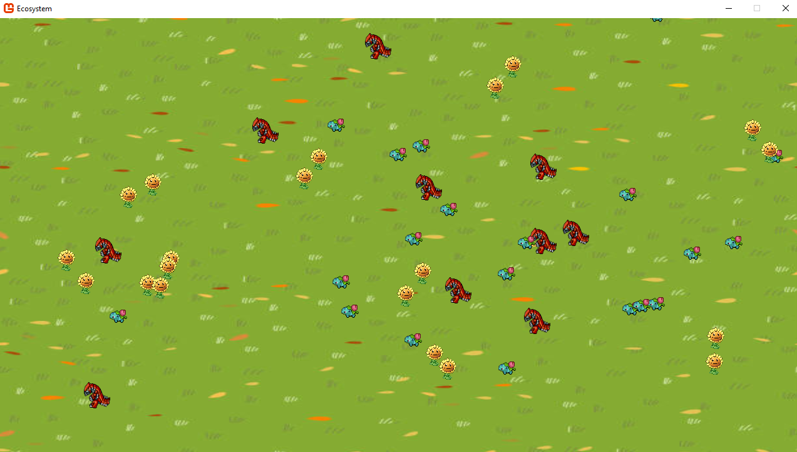
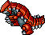
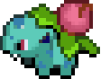
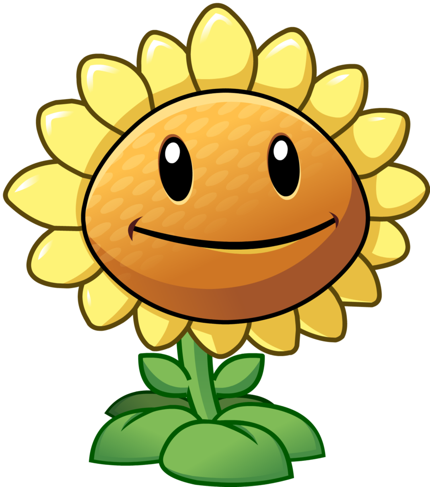

# Ecosystem
Simulation of an Ecosystem using Monogame

## Student
* Dubois Hugo : 195347
* Borbolla Alejandro : 195004

## Run
Launch the `Ecosystem` project to start the simulation.

## Framework
Our simulation is based on the Monogame framework in C#.

	

## Simulation description
Every entities is represented by a sprite.
* Carnivorous: Groudon

	

* Herbivorous: Herbizarre

* Plants: SunPlant

	

* OrganicWaste: Poop

	

* Meat: Chicken leg

	

