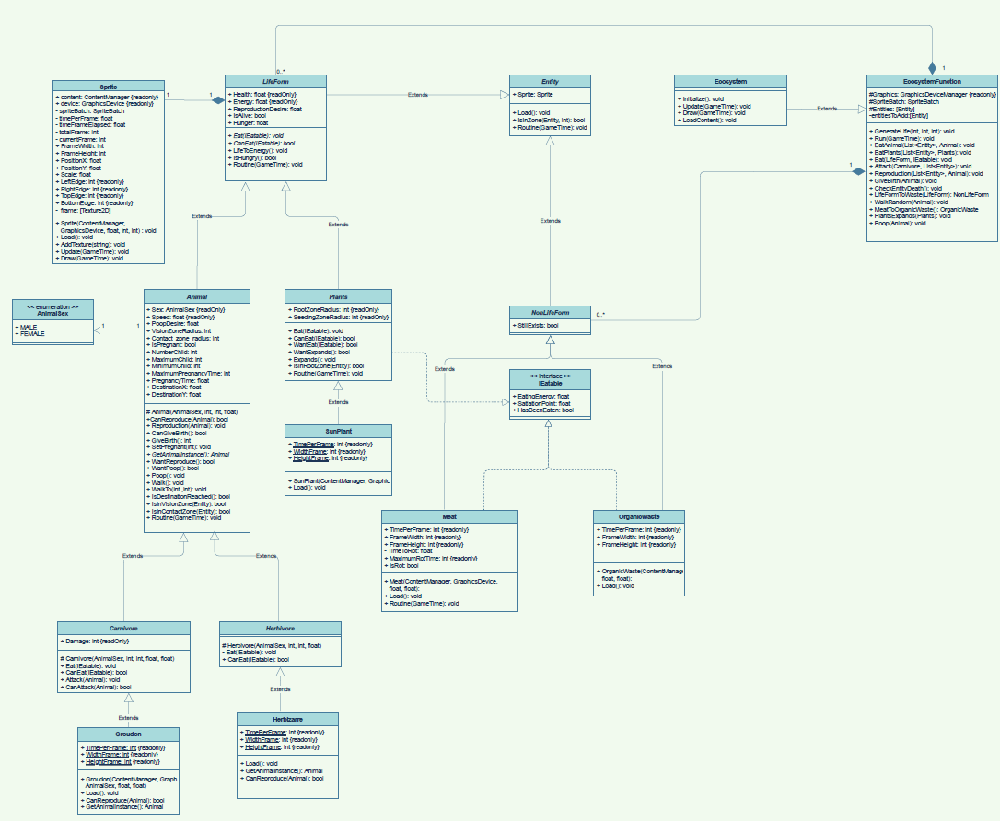

# Ecosystem
Simulation of an Ecosystem using Monogame

## Student
* Dubois Hugo : 195347
* Borbolla Alejandro : 195004

## Run
Launch the `Ecosystem` project to start the simulation.

## Framework
Our simulation is based on the Monogame framework in C#.

<p align="center">
	
</p>

## Simulation description
Every entities is represented by a sprite.
* Carnivorous: Groudon

<p align="center">
	
</p>

* Herbivorous: Herbizarre

<p align="center">

</p>

* Plants: SunPlant
<p align="center">
	
</p>

* OrganicWaste: Poop
<p align="center">
	
</p>

* Meat: Chicken leg
<p align="center">
	
</p>

## Class diagram
<p align="center">
	<a href="./Diagrams/ClassDiagram.pdf">
		
	</a>
</p>

## Sequence diagram
<p align="center">
	<a href="./Diagrams/SequenceDiagram.pdf">
		
	</a>
</p>

## SOLID principles
### Single responsibility principle
> A class should have one and only one reason to change, meaning that a class should only have one job.
>
> -- <cite>Robert C. Martin</cite>

As example the class Carnivore as only the job to set all the caracteristics at the carnivorous such as the damage they can do or the possibility to attack other animals.
```C#
	public abstract class Carnivore : Animal
    {
        private float damage; // Damages per seconds

        protected Carnivore(AnimalSex sex, int visionZoneRadius, int contactZoneRadius, float speed, float damage) : 
            base(sex, visionZoneRadius, contactZoneRadius, speed)
        {
            this.damage = damage;
        }

        public float Damage
        {
            get { return damage; }
        }

        // TODO: Implement the Eat method when the Meat is created
        public override void Eat(IEatable food)
        {
            if (CanEat(food))
            {
                Energy += food.EatingEnergy;
                Hunger -= food.SatiationPoint;
            }
        }

        public override bool CanEat(IEatable food)
        {
            return (food is Meat);
        }

        public void Attack(Animal prey)
        {
            if (CanAttack(prey))
                prey.Health -= damage;
        }

        public bool CanAttack(Animal prey)
        {
            return (prey is Herbivore);
        }
    }
```

### Liskov substitution principle
>Let q(x) be a property provable about objects of x of type T.
Then q(y) should be provable for objects y of type S
where S is a subtype of T.
>
> -- <cite>Barbara Liskov and Jeannette Wing</cite>

Animal can be replaced by every of its subclass (Carnivore, Herbivore, ...).

As example the method EatAnimal is using this principle by using an `Animal` object as `Carnivore`. 
```C#
	void EatAnimal(List<Entity> visionList, Animal lifeForm)
	{
		if (lifeForm.IsHungry() == false)
			return;

		List<Entity> eatableInVision = new List<Entity>(visionList.FindAll(delegate (Entity visionLife) { return lifeForm.CanEat(visionLife as IEatable); }));
		List<Entity> eatableInContact = new List<Entity>(eatableInVision.FindAll(lifeForm.IsInContactZone));

		if (eatableInContact.Count != 0)
			Eat(lifeForm, eatableInContact[0] as IEatable);
		else if (eatableInVision.Count != 0)
		{
			lifeForm.DestinationX = eatableInVision[0].Sprite.PositionX;
			lifeForm.DestinationY = eatableInVision[0].Sprite.PositionY;
		}
		else if (lifeForm is Carnivore)
			Attack(lifeForm as Carnivore, visionList);
	}
```
